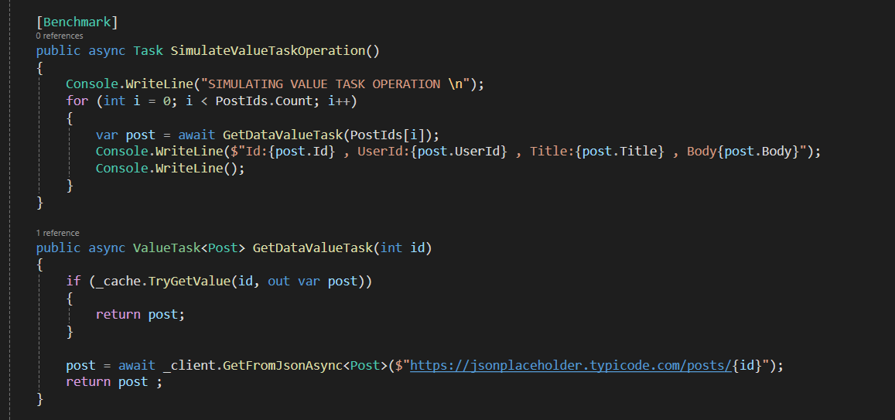
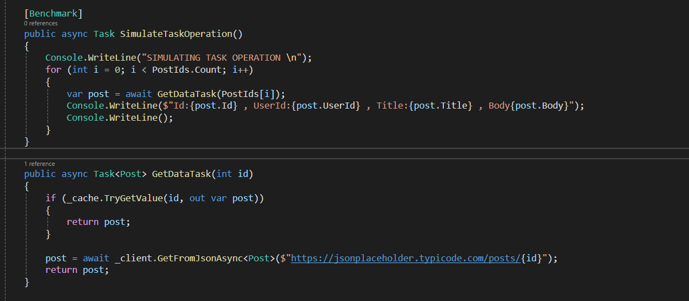
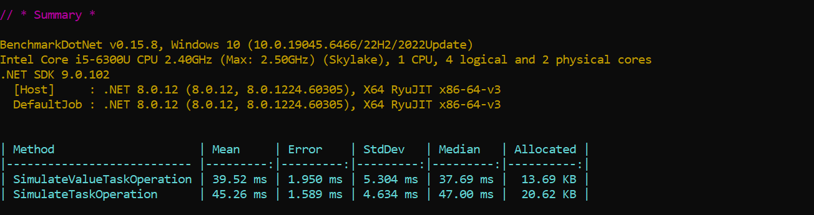

In this article, Task and ValueTask are fundamentals APIs in .NET used by developers when they work on asynchronous programming but still get confused. Task was introduced to .NET 4.0 while ValueTask was introduced to .NET Core 2.1. They both allow applications to be responsive why executing a long running operations and also scalability.I am going to explain the difference between Task and ValueTask, the usecases, strength and limitations.

### Task vs ValueTask
In Async world, we do a lot of I/O operation such as Database, External APIs calls as well as interacting with the file system even though concurrently we are actually managing threads and not having a soley dedicated thread for async calls, there still a little drawback with Task because Task object get allocated in the heap and much more a drawback if we find ourselves requesting for data that we already have. For example , you are calling an endpoint many time to fetch data but you want to check the if you have the data in memory before you make the http calls, calling an endpoint in a hundreds/thousands means you would have an hundreds/thousands of object stored in the heap.

This is where ValueTask shines, ValueTask is a **struct** (value type) introduced to solve the allocation overhead of Task. It is a perfomance tool that addresses this because it can be synchronous as well as asynchronous, synchronous in the sense that we check if to see if we have the data , if we do it return the value, if it doesnt the it makes an Http call, in that way we are saving allocation Task object on the Heap

```c#
public async ValueTask<int> GetDataAsync() 
{
    if (isCached) 
    {
       return 42; // No heap allocation!
    }
    
    return await FetchFromDbAsync(); // Only allocates if it actually goes to the DB
}
```
### Example
Here we try to benchmark the difference between using Task and ValueTask, we have to benchmark operations

SimulateValueTaskOperation() iterate through a number of times with postIds, calls GetDataValueTask(id) method to check the cache to see if data can be found, if not then call the endpoint to fetch the post,it return a ValueTask<Post>



SimulateTaskOperation() does the same but calls GetDataTask(id) and return a Task<Post>



After Benchmark, here is the result below, you would notice SimulateValueTaskOperation Average Mean is pretty much faster than SimulateTaskOperation, but we are more interested in the allocated space in memory for the objects, SimulateValueTaskOperation averages 13.69kb while SimulateTaskOperation averages 20.52kb. THe difference might not be too much because we the iterations was in a couple of hundreds, imagine we did for iteration for thousands of hendred or millions.



### Limitations
While ValueTask is a performance tool, it is not a replacement of Task, ValueTask should to be used to

- Await a ValueTask multiple times
- Store it and later await later
- Call a GetAwaiter and GetResult on ValueTask
- Running ValueTask Concurrently
- convert to Task unnecessarily

Below it the code snippets of the Limitations

#### Store it and later await later
❌ **Bad**
```c#
var v1 =  ValueTaskMethod()
await v1
```

#### Await a ValueTask multiple times
❌ **Bad**
```c#
var v1 =  ValueTaskMethod()
var result1 = await v1
var result2 = await v1
```

#### Call a GetAwaiter and GetResult
❌ **Bad**
```c#
var v1 =  ValueTaskMethod()
var result = v1.GetAwaiter().GetResult()
```

#### Running ValueTask Concurrently
❌ **Bad**
```c#
var v1 =  ValueTaskMethod()
Task.Run(async () => await v1)
Task.Run(async () => await v1)
```

#### Mental Model
ValueTask is not a replacement for Task, it should be used when you think about memory optimazation as well as when you have operation that can be synchronous or asynchronous.


#### Final
You can get code samples for this post here [Task Vs ValueTask](https://github.com/adewoleadenigbagbe/Blog-Code-Samples/tree/main/TaskVsValueTask)
